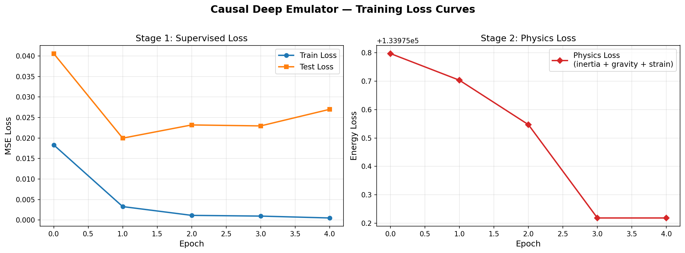
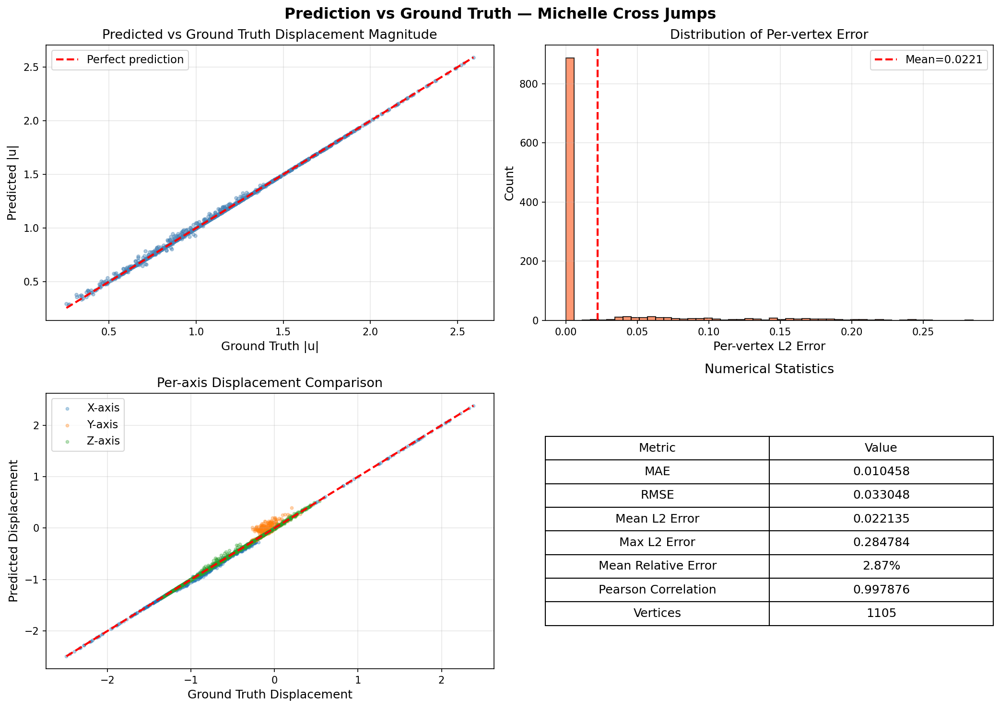

# Causal Deep Emulator — Experiment Results

## Training Configuration

| Parameter | Stage 1 (Supervised) | Stage 2 (Physics) |
|---|---|---|
| Loss Function | MSE (pred vs ground truth) | Physics energy (inertia + gravity + Neo-Hookean strain) |
| Epochs | 5 | 5 |
| Initial Learning Rate | 1e-4 | 1e-5 |
| LR Decay | 0.96 per epoch | 0.98 per epoch |
| Batch Size | 64 | 4 |
| Optimizer | Adam | Adam |
| Rollout Horizon K | — | 1 (progressive warmup) |
| Temporal Window T | 5 | 5 |
| Multi-scale Levels | 3 | 3 |

## Training Loss

### Stage 1: Supervised Loss (MSE)

| Epoch | Train Loss | Test Loss |
|---|---|---|
| 0 | 0.018325 | 0.040612 |
| 1 | 0.003272 | 0.019970 |
| 2 | 0.001129 | 0.023194 |
| 3 | 0.000951 | 0.022958 |
| 4 | 0.000494 | 0.027003 |

- Train loss decreased from 0.0183 to 0.0005 (97.3% reduction)
- Test loss dropped from 0.0406 to 0.0270 at epoch 1, then slightly increased (mild overfitting)

### Stage 2: Physics Loss (Energy)

| Epoch | Physics Loss | Learning Rate |
|---|---|---|
| 0 | 133975.80 | 1.00e-5 |
| 1 | 133975.70 | 1.00e-5 |
| 2 | 133975.55 | 9.60e-6 |
| 3 | 133975.22 | 9.22e-6 |
| 4 | 133975.22 | 8.85e-6 |

- Physics loss (inertia + gravity + strain energy) decreased steadily
- Rollout horizon K = 1 throughout (warmup phase)

## Test Evaluation

**Dataset:** Michelle character, cross_jumps motion sequence  
**Frames:** 122 frames (autoregressive rollout)  
**Vertices:** 1105 per frame  
**Weight:** `stage2_0004.weight` (final Stage 2 checkpoint)

### Numerical Statistics (Prediction vs Ground Truth)

| Metric | Value |
|---|---|
| Mean Absolute Error (MAE) | 0.010458 |
| Root Mean Square Error (RMSE) | 0.033048 |
| Mean L2 Error (per vertex) | 0.022135 |
| Max L2 Error | 0.284784 |
| Mean Relative Error | 2.87% |
| Pearson Correlation | 0.9979 |

### Per-axis Error Breakdown

| Axis | MAE | Max Absolute Error |
|---|---|---|
| X | 0.008109 | 0.094611 |
| Y | 0.018358 | 0.278503 |
| Z | 0.004907 | 0.121537 |

- Y-axis has the largest error, likely due to gravity-driven vertical motion being harder to predict
- Z-axis is most accurate

### Displacement Range

| | Min |u| | Max |u| |
|---|---|---|
| Ground Truth | 0.2553 | 2.5914 |
| Prediction | 0.2804 | 2.5914 |

## Visual Results

Each rendered frame shows three views side by side: **Input | Ground Truth | Prediction**

- 122 frames rendered as PNG images (`0.png` to `121.png`)
- Compiled into `animation.mp4` at 30 fps
